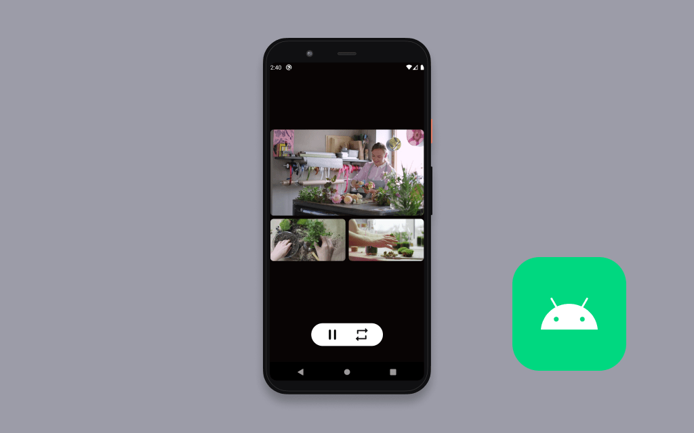

# Amazon IVS Multiple Players Android Demo

This repository contains demo app which shows how to instantiate multiple players simultaneously, and switch between 3 predefined layouts/sets of demo streams.

## Setup

1. Clone the repository to your local machine.
2. Open the cloned repository in [Android Studio](https://developer.android.com/studio), or an IDE of your choice.
3. Run the application on an emulated device or a physical device running API level 29 or later.

## License
This project is licensed under the MIT-0 License. See the LICENSE file.
